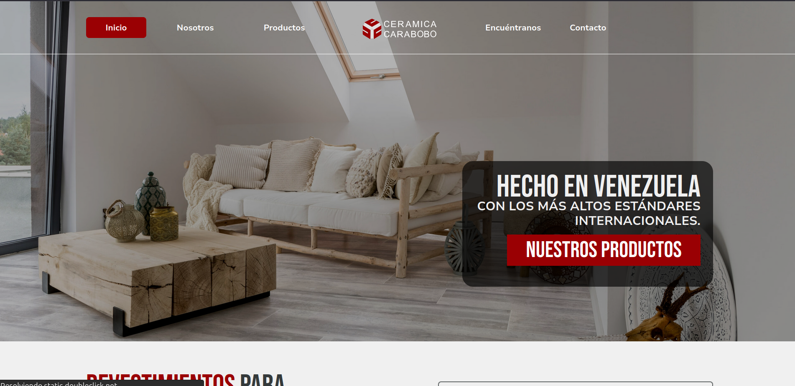
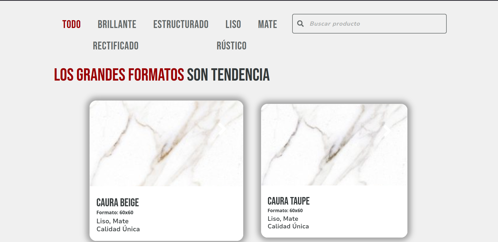
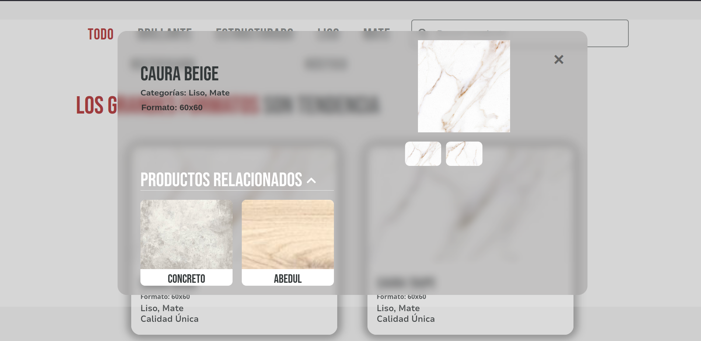
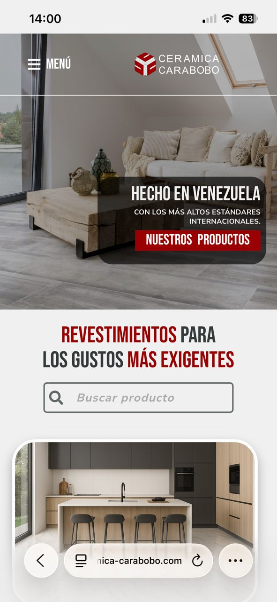

# Cerámica Carabobo — Sitio Web Corporativo

Sitio web corporativo para la marca cerámica líder de Venezuela.
Desarrollado como freelancer en colaboración con un equipo de diseño UI.

🔗 **[Ver sitio en vivo](https://ceramica-carabobo.com)**

---

## Stack tecnológico

| Herramienta | Uso |
|---|---|
| WordPress | CMS principal |
| Elementor Pro | Maquetación visual |
| Advanced Custom Fields (ACF) | Campos personalizados por producto |
| WooCommerce | Gestión del catálogo |
| Elementor Essential & Unlimited | Componentes avanzados |
| HTML / JavaScript | Código personalizado |
| Migración de hosting | Deploy + SSL |

---

## Lo que desarrollé

- Implementación pixel-perfect del diseño aprobado por el equipo de diseño UI
- Catálogo filtrable por acabado (Mate, Liso, Brillante, Rústico, Rectificado) con JS personalizado
- Arquitectura de datos con ACF: formato, acabado, galería de texturas y productos relacionados
- Importación masiva del catálogo completo desde Excel
- Migración completa de hosting con configuración de dominio y SSL
- Diseño 100% responsive — desktop, tablet y móvil

---

## Screenshots

### Hero

### Catálogo con filtros

### Ficha de producto

### Responsive

---

## Sobre el proyecto

> Cerámica Carabobo es un fabricante venezolano de revestimientos cerámicos
> con estándares internacionales. El sitio funciona como vitrina de catálogo,
> canal para distribuidores y plataforma de marca.

---

*Desarrollado por [José Casadiego](https://www.linkedin.com/in/jcasadiegoa/) — Freelancer WordPress*
